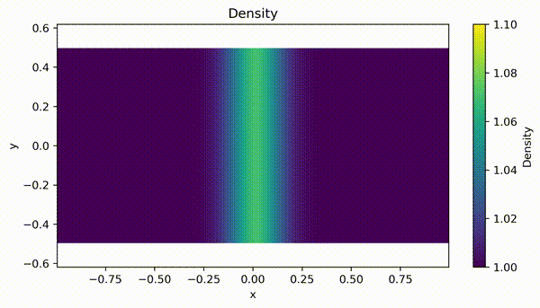
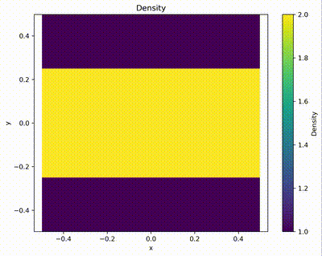

# Gaukuk

**Gaukuk** is a lightweight, high-performance hydrodynamics simulation code written in C++, designed for compressible fluid dynamics on shared-memory systems.

The code emphasizes **performance-oriented design** for small-to-medium scale simulations, with:
- Fully **flattened data layout** for cache efficiency and SIMD/vectorization
- Optimized memory access patterns to minimize bandwidth bottlenecks
- OpenMP parallelization for multi-core CPUs

It currently supports:
- Finite-volume methods for compressible flow
- Up to 3rd-order time integration (RK3)
- 1st/2nd-order spatial reconstruction
- HLLC Riemann solver
- Flexible and modular problem setup system

---

## Design Highlights

- Compile-time polymorphism for hot-path components (EOS, flux) to eliminate runtime overhead
- Static dispatch via function pointers for integrators and boundary conditions
- Careful separation of hot and cold paths for better performance
- Minimal branching in inner loops to improve vectorization

---

## Demo

### Sod Shock Tube


A standard 1D Riemann problem used to validate shock-capturing schemes.  
The simulation is compared against the exact solution (red line), showing excellent agreement in density, pressure, velocity, and internal energy.

Different markers indicate varying spatial resolution and reconstruction order (e.g. `rc2_r256` = 2nd-order reconstruction with 256 grid cells).  
The simulation uses RK2 time integration and is shown at *t = 0.2*.

### Reflected Wave


A Gaussian wave packet propagating in the x-direction and reflecting at domain boundaries.  
This test verifies numerical dissipation and boundary condition handling.

The simulation uses RK2 with 2nd-order spatial reconstruction on a 256×128 grid.

### Kelvin–Helmholtz Instability


A classic instability driven by velocity shear between two fluid layers.  
This test demonstrates the code’s ability to capture small perturbations and nonlinear vortex evolution.

The simulation uses periodic boundary conditions with 2nd-order accuracy in both space and time on a 256×256 grid.

---

##  Quick Start

```bash
# 1. Configure
python configure.py --setup shock_tube --flux hllc --eos adiabatic

# 2. Compile
make -j

# 3. Run
cd bin
./gaukuk.sim -i ../input/shock_tube.in
```

Plot the result:

```bash
python plot_sod.py
```

---

##  Build & Configuration

### Option 1: Python configure script

```bash
python configure.py [options]
```

Options:

- --setup: kh, shock_tube, wave_test, or custom setup
- --flux: hllc
- --eos: adiabatic
- -openmp: enable OpenMP

Example:

```bash
python configure.py --setup=kh -openmp
```

Then compile

```bash
make -j
```

---

### Option 2: Manual configuration

Edit:

```bash
config.mk
```

Then compile

```bash
make -j
```

---

## Running the Simulation

```bash
cd bin
./gaukuk.sim -i <input_file>
```

Example:

```bash
./gaukuk.sim -i ../input/kh.in
```

---

## Input File Overview

Simulation parameters are controlled via `.in` files.

Key categories:

- Equation of state (e.g. gamma)
- Simulation control (tmax, CFL, integrator: Euler / RK2 / RK3)
- Spatial reconstruction (1st / 2nd order)
- Output control
- Domain and mesh
- Boundary conditions

---

## Problem Setup

Each setup is defined in:

```
src/setup/setup_XXX.cpp
```

To add a new setup:

1. Create a new file `setup_myproblem.cpp`
2. Follow `setup_example.cpp`
3. Use:
```bash
python configure.py --setup myproblem
```

---

## Data Analysis

Use Python tools:

```python
from read_gaukuk import ReadGaukuk

data = ReadGaukuk("cons_00010", isCons=True)
```

See:
- plot_kh.py
- plot_sod.py

---

## Future Work

- More Riemann solvers
- More EOS models
- Higher-order reconstruction
- GPU acceleration

---

## Author

Developed by **Shunquan Huang**  
Ph.D. Candidate in Astrophysics, UNLV  

---

## License

This project is released under the **MIT License**.  

Permission is hereby granted, free of charge, to any person obtaining a copy of this software and associated documentation files (the “Software”), to deal in the Software without restriction, including without limitation the rights to use, copy, modify, merge, publish, distribute, sublicense, and/or sell copies of the Software, and to permit persons to whom the Software is furnished to do so, subject to the following conditions:

The above copyright notice and this permission notice shall be included in all copies or substantial portions of the Software.