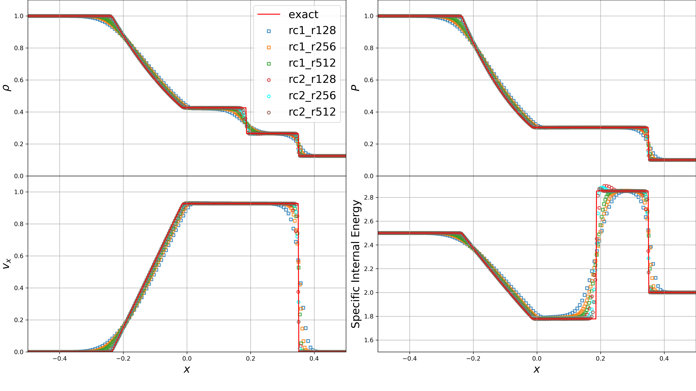

# Gaukuk

**Gaukuk** is a lightweight, modular hydrodynamics simulation code written in C++, designed for studying compressible fluid dynamics problems and for building high-performance numerical solvers.

It currently supports:
- Finite-volume methods for compressible flow
- Up to **3rd-order time integration (RK3)**
- **1st/2nd-order spatial reconstruction**
- HLLC Riemann solver
- OpenMP parallelization
- Flexible problem setup system

---

##  Demo

### Sod Shock Tube


### Reflected Wave


### Kelvin–Helmholtz Instability


---

##  Quick Start

```bash
# 1. Configure
python configure.py --setup shock_tube --flux hllc --eos adiabatic

# 2. Compile
make -j

# 3. Run
cd bin
./gaukuk.sim -i ../input/shock_tube.in
```

Plot the result:

```bash
python plot_sod.py
```

---

##  Build & Configuration

### Option 1: Python configure script

```bash
python configure.py [options]
```

Options:

- --setup: kh, shock_tube, wave_test, or custom setup
- --flux: hllc
- --eos: adiabatic
- -openmp: enable OpenMP

Example:

```bash
python configure.py --setup=kh -openmp
```

---

### Option 2: Manual configuration

Edit:

```bash
config.mk
```

---

## Running the Simulation

```bash
cd bin
./gaukuk.sim -i <input_file>
```

Example:

```bash
./gaukuk.sim -i ../input/kh.in
```

---

## Input File Overview

Simulation parameters are controlled via `.in` files.

Key categories:

- Equation of state (e.g. gamma)
- Simulation control (tmax, CFL, integrator: Euler / RK2 / RK3)
- Spatial reconstruction (1st / 2nd order)
- Output control
- Domain and mesh
- Boundary conditions

---

## Problem Setup

Each setup is defined in:

```
src/setup/setup_XXX.cpp
```

To add a new setup:

1. Create a new file `setup_myproblem.cpp`
2. Follow `setup_example.cpp`
3. Use:
```bash
python configure.py --setup myproblem
```

---

## Data Analysis

Use Python tools:

```python
from read_gaukuk import ReadGaukuk

data = ReadGaukuk("cons_00010", isCons=True)
```

See:
- plot_kh.py
- plot_sod.py

---

## Features

- Modular solver design
- Up to RK3 time integration
- 1st/2nd order reconstruction
- OpenMP parallelization
- Clean I/O pipeline

---

## Future Work

- More Riemann solvers
- More EOS models
- Higher-order reconstruction
- GPU acceleration